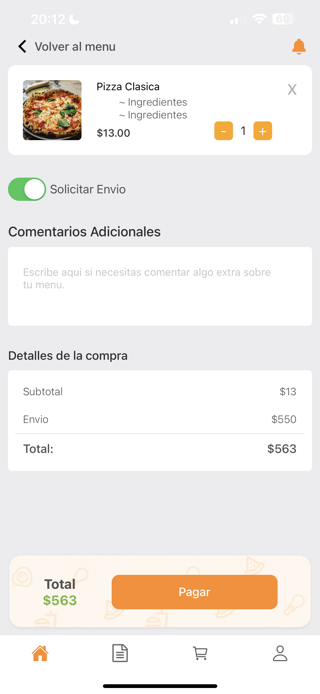

<h1 align="center">React-Native-Developer</h1>

# Delivery App

A delivery app was developed using React Native and Firebase technologies. From a web page, the restaurant owner uploads the products, which are then reflected in the mobile application. The app also allows enabling or disabling products in real time.

Additionally, when an order is placed, it is sent to the restaurant's web page where the owner can provide the customer with an estimated delivery time, which is displayed as a countdown timer in the mobile application.

In summary, the app provides a seamless delivery experience by leveraging React Native and Firebase. The restaurant owner can manage products in real time through the web page, and customers can place orders and track their progress through the mobile app, including receiving estimated delivery times.

  
  
  
  

Technologies

- React Native 💻
- React.js 🚀
- Redux ⚛️
- Firebase 🔥
- Node 🌐
- Google Sign 🔑
- Clean Architecture 🔨
- GoRoute for Navigation 🗺️
- Optimized for iOS and Android 📱

 

# Logins UI

I'm a versatile frontend developer and I can adapt to different types of projects. I specialize in creating attractive and functional user experiences. Here are some examples of logins I have implemented, some of which include animations to enhance user interaction:

As you can see, I designed a login with smooth transitions that provide a seamless experience for users when entering their credentials. The transitions between different screens and form elements are executed elegantly and without interruptions.

<video width="400" height="400" controls>
  <source src="./assets/RPReplay_Final1688776591.MP4" type="video/mp4">
</video>
  
  
  
  
  

Technologies

- React Native 💻
- Redux ⚛️
- Firebase 🔥
- Clean Architecture 🔨
- GoRoute for Navigation 🗺️
- Optimized for iOS and Android 📱
- Animation 🚀
   

# Cine App

A cinema application was developed that allows users to select movies, theaters, dates, showtimes, and seats. Additionally, real-time information is displayed about occupied seats, available seats, and selected seats. To achieve this, Firebase and React Native technologies were utilized, ensuring instant data updates.

This application offers an interactive and seamless experience, allowing users to explore different movie options, theaters, and showtimes, and select their preferred seats. The integration with Firebase ensures that data is always up-to-date and synchronized among users, providing a consistent experience for all application users.

With this cinema app, users can enjoy a convenient and efficient way to reserve seats for the movies they want to watch, offering them greater comfort and control over their cinema experience.

  
  
  

Technologies

- React Native 💻
- Redux ⚛️
- Node 🌐
- Clean Architecture 🔨
- GoRoute for Navigation 🗺️
- Optimized for iOS and Android 📱

 

# Coffe App

An application was developed where users can select different types of coffee with their respective sizes and prices, which are updated in real time. Once the purchase is made, a QR code is generated that the user can use at the coffee shop to verify their purchase.

This application provides an intuitive and convenient experience for coffee lovers, allowing them to explore a variety of coffee options and customize their order based on their preferences. The prices are automatically updated, providing transparency to the user and ensuring they always have the latest information.

Furthermore, by generating the QR code, the authenticity and verification of the purchase at the coffee shop are guaranteed. Users simply scan the QR code at the point of sale to confirm their purchase and enjoy their selected coffee.

With this application, users can enjoy a smooth and secure experience when ordering coffee, with the convenience of having updated information and the assurance of a verifiable purchase process at the coffee shop.

  
  
  
  

Technologies

- React Native 💻
- React.js 🚀
- Redux ⚛️
- Firebase 🔥
- Node 🌐
- Clean Architecture 🔨
- GoRoute for Navigation 🗺️
- Optimized for iOS and Android 📱
